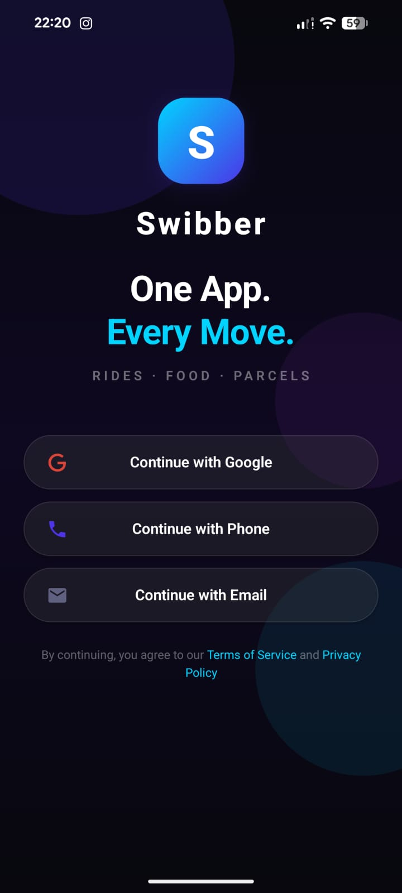
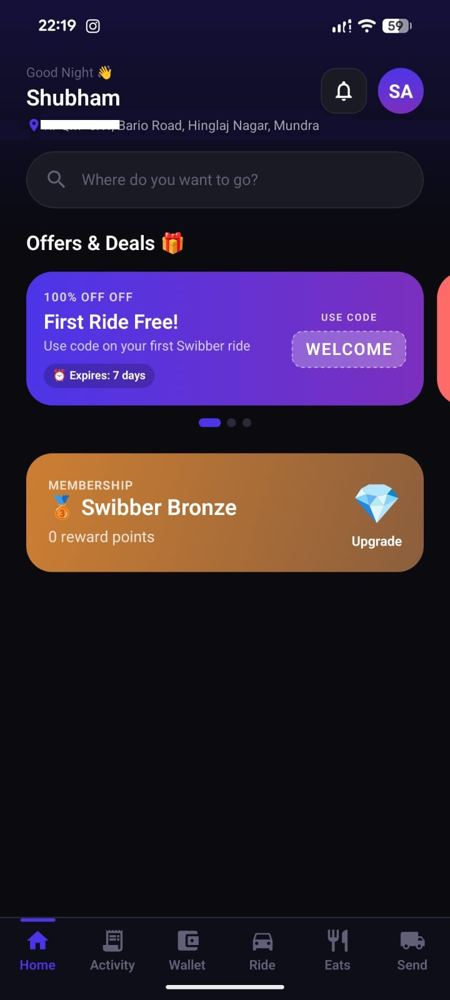
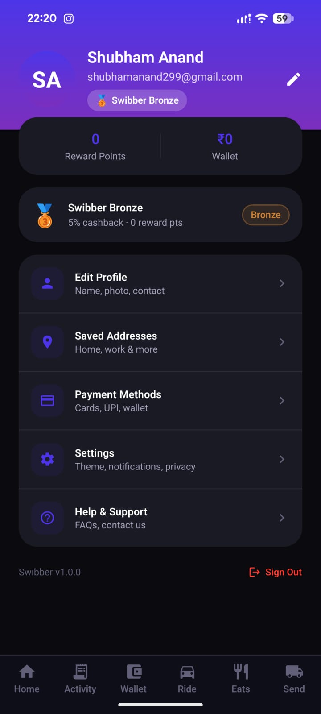
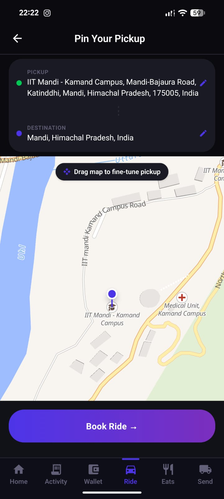
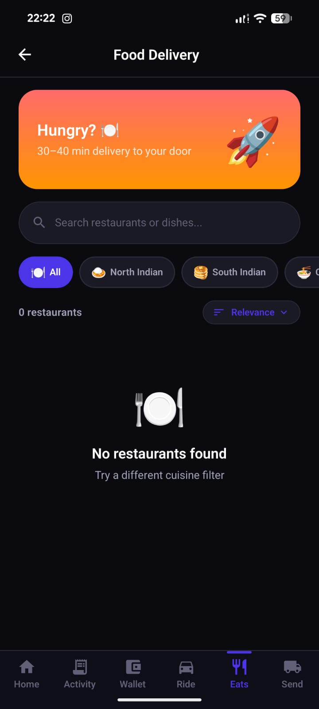
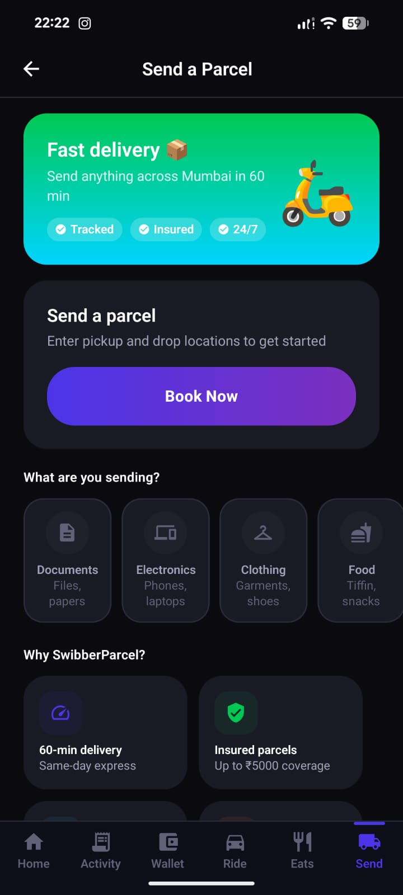
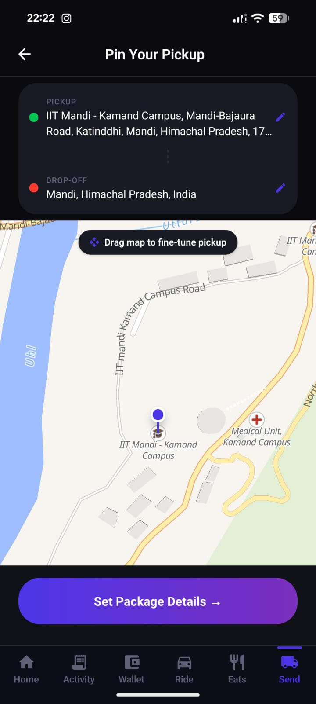

<div align="center">

# 🚀 Swibber

### A Production-Grade Full-Stack Super App

*Ride Booking · Food Delivery · Parcel Delivery — all in one platform*

[](https://www.typescriptlang.org/)
[](https://reactnative.dev/)
[](https://nodejs.org/)
[](https://www.mongodb.com/)
[](https://redis.io/)
[](https://socket.io/)
[](https://razorpay.com/)
[](https://render.com/)

</div>

---

## 📌 Project Summary

**Swibber** is a full-stack, production-ready super app that combines ride booking, food delivery, and parcel delivery into a single unified platform — inspired by the engineering depth of Uber, Swiggy, Zomato, and Porter.

Built end-to-end with **TypeScript** across both frontend and backend, Swibber features real-time driver tracking over WebSockets, a custom fare engine with dynamic pricing, Razorpay payment flows with backend verification, OSRM-powered route calculation, and a Redis-backed caching layer — all deployed to cloud infrastructure.

This is not a tutorial clone. Every module is designed with production concerns in mind: JWT auth with refresh token rotation, rate limiting, role-based access control, auto-cancellation background jobs, socket authentication, and a fully typed codebase with zero compile errors.

---

## ✨ Feature Highlights

<table>
<tr>
<td width="33%" valign="top">

### 🚗 Ride Module
- Multi-vehicle fare estimation
- Dynamic surge pricing engine
- Live driver tracking via Socket.IO
- ETA calculation using OSRM
- Cancellation system with policies
- Ride receipts & activity history
- Driver rating system

</td>
<td width="33%" valign="top">

### 🍔 Food Module
- Restaurant & menu browsing
- Cart system with item management
- Order placement & tracking
- Real-time order status updates
- Push notifications per stage
- Order receipts & history
- Restaurant ratings

</td>
<td width="33%" valign="top">

### 📦 Parcel Module
- Pickup & drop location selection
- Distance-based fare calculation
- Live parcel tracking
- Delivery status timeline
- Delivery receipts
- Cancellation support
- Weight & size-based pricing

</td>
</tr>
</table>

---

## 🏗️ Architecture

```
┌─────────────────────────────────────────────────────────────────┐
│                        CLIENT LAYER                             │
│                   React Native + Expo (TypeScript)              │
│  ┌──────────┐  ┌──────────┐  ┌──────────┐  ┌───────────────┐  │
│  │   Ride   │  │   Food   │  │  Parcel  │  │Auth / Profile │  │
│  │  Module  │  │  Module  │  │  Module  │  │    Module     │  │
│  └────┬─────┘  └────┬─────┘  └────┬─────┘  └───────┬───────┘  │
│       │              │              │                │           │
│  ┌────▼──────────────▼──────────────▼────────────────▼───────┐  │
│  │           Zustand State Management + React Navigation      │  │
│  └───────────────────────────┬─────────────────────────────── ┘  │
└──────────────────────────────┼──────────────────────────────────┘
                               │ REST API + WebSocket
┌──────────────────────────────▼──────────────────────────────────┐
│                        API GATEWAY LAYER                        │
│                    Express.js (Node.js + TypeScript)            │
│  ┌─────────────┐  ┌──────────────┐  ┌────────────────────────┐ │
│  │  JWT Auth   │  │ Rate Limiter │  │  Socket.IO Server      │ │
│  │  Middleware │  │  (Redis)     │  │  (Auth + Namespaces)   │ │
│  └─────────────┘  └──────────────┘  └────────────────────────┘ │
│                                                                  │
│  ┌──────────┐  ┌──────────┐  ┌────────────┐  ┌─────────────┐  │
│  │   Ride   │  │   Food   │  │   Parcel   │  │  Payments   │  │
│  │ Service  │  │ Service  │  │  Service   │  │  Service    │  │
│  └────┬─────┘  └────┬─────┘  └─────┬──────┘  └──────┬──────┘  │
│       │              │               │                 │         │
│  ┌────▼──────────────▼───────────────▼─────────────────▼──────┐ │
│  │              Business Logic + Fare Engines                  │ │
│  └─────────────────────────┬───────────────────────────────── ┘ │
└─────────────────────────────┼────────────────────────────────── ┘
                              │
┌─────────────────────────────▼────────────────────────────────── ┐
│                       DATA + INFRA LAYER                        │
│  ┌──────────────────┐   ┌────────────────┐   ┌───────────────┐ │
│  │  MongoDB Atlas   │   │  Redis Cache   │   │  OSRM Engine  │ │
│  │  (Primary DB)    │   │  (Sessions +   │   │  (Routing +   │ │
│  │                  │   │   Rate Limit)  │   │   ETA)        │ │
│  └──────────────────┘   └────────────────┘   └───────────────┘ │
│  ┌──────────────────┐   ┌────────────────┐                      │
│  │    Razorpay      │   │  OpenStreetMap │                      │
│  │  (Payments)      │   │  (Map Tiles)   │                      │
│  └──────────────────┘   └────────────────┘                      │
└─────────────────────────────────────────────────────────────────┘
```

---

## 🗂️ Project Structure

```
swibber/
├── frontend/                        # React Native (Expo) App
│   ├── src/
│   │   ├── screens/
│   │   │   ├── ride/                # Ride booking screens
│   │   │   ├── food/                # Food ordering screens
│   │   │   ├── parcel/              # Parcel delivery screens
│   │   │   ├── auth/                # Authentication screens
│   │   │   └── profile/             # User profile & history
│   │   ├── components/              # Shared UI components
│   │   ├── store/                   # Zustand state slices
│   │   ├── hooks/                   # Custom React hooks
│   │   ├── services/                # API service layer
│   │   ├── navigation/              # React Navigation config
│   │   ├── context/                 # React Context providers
│   │   │   └── DialogContext.tsx    # Global dialog/alert system
│   │   ├── types/                   # Shared TypeScript types
│   │   └── utils/                   # Helper utilities
│   ├── app.json
│   └── package.json
│
├── backend/                         # Node.js + Express API
│   ├── src/
│   │   ├── routes/
│   │   │   ├── auth.routes.ts
│   │   │   ├── ride.routes.ts
│   │   │   ├── food.routes.ts
│   │   │   ├── parcel.routes.ts
│   │   │   └── payment.routes.ts
│   │   ├── controllers/             # Request handlers
│   │   ├── services/                # Business logic layer
│   │   │   ├── fareEngine.ts        # Dynamic pricing engine
│   │   │   ├── parcelEngine.ts      # Parcel fare calculation
│   │   │   └── osrmService.ts       # Routing & ETA
│   │   ├── models/                  # Mongoose schemas
│   │   ├── middleware/
│   │   │   ├── auth.middleware.ts   # JWT verification
│   │   │   ├── rateLimiter.ts       # Redis rate limiting
│   │   │   └── roleGuard.ts         # Role-based access
│   │   ├── socket/                  # Socket.IO namespaces
│   │   ├── jobs/                    # Background cron jobs
│   │   ├── enums/                   # Shared enum definitions
│   │   └── types/                   # TypeScript interfaces
│   └── package.json
│
└── README.md
```

---

## 📸 Screenshots

<div align="center">

### Authentication


### Home & Profile
<p>
  
  &nbsp;&nbsp;&nbsp;
  
</p>

### Ride Booking


### Food Delivery


### Parcel Delivery
<p>
  
  &nbsp;&nbsp;&nbsp;
  
</p>

</div>

---

## 🛠️ Tech Stack

| Layer | Technology |
|-------|------------|
| **Mobile Frontend** | React Native, Expo, TypeScript |
| **State Management** | Zustand |
| **Navigation** | React Navigation v6 |
| **Backend** | Node.js, Express.js, TypeScript |
| **Realtime** | Socket.IO (client + server) |
| **Database** | MongoDB Atlas (Mongoose ODM) |
| **Caching / Rate Limiting** | Redis |
| **Authentication** | JWT + Refresh Token Rotation |
| **Maps & Routing** | OpenStreetMap, OSRM |
| **Payments** | Razorpay |
| **Deployment** | Render (backend), MongoDB Atlas (DB) |

---

## ⚙️ Setup & Installation

### Prerequisites

- Node.js 18+
- Expo CLI (`npm install -g expo-cli`)
- MongoDB Atlas account
- Redis instance (local or cloud)
- Razorpay account (test mode)

### 1. Clone the repository

```bash
git clone https://github.com/Shubham2310D/swibber.git
cd swibber
```

### 2. Backend Setup

```bash
cd backend
npm install
```

Create a `.env` file in `backend/`:

```env
PORT=5000
MONGODB_URI=your_mongodb_atlas_uri
REDIS_URL=your_redis_url
JWT_SECRET=your_jwt_secret
JWT_REFRESH_SECRET=your_refresh_secret
RAZORPAY_KEY_ID=your_razorpay_key_id
RAZORPAY_KEY_SECRET=your_razorpay_key_secret
OSRM_BASE_URL=https://router.project-osrm.org
```

```bash
npm run dev
```

### 3. Frontend Setup

```bash
cd frontend
npm install
```

Create a `.env` file in `frontend/`:

```env
EXPO_PUBLIC_API_URL=http://localhost:5000
EXPO_PUBLIC_SOCKET_URL=http://localhost:5000
EXPO_PUBLIC_RAZORPAY_KEY_ID=your_razorpay_key_id
```

```bash
npx expo start
```

---

## 📡 API Overview

### Authentication
| Method | Endpoint | Description |
|--------|----------|-------------|
| `POST` | `/api/auth/register` | Register new user |
| `POST` | `/api/auth/login` | Login with credentials |
| `POST` | `/api/auth/refresh` | Refresh JWT access token |
| `POST` | `/api/auth/logout` | Invalidate refresh token |

### Ride
| Method | Endpoint | Description |
|--------|----------|-------------|
| `POST` | `/api/ride/estimate` | Get fare estimate |
| `POST` | `/api/ride/book` | Book a ride |
| `GET` | `/api/ride/:id` | Get ride details |
| `PATCH` | `/api/ride/:id/cancel` | Cancel a ride |
| `GET` | `/api/ride/history` | User ride history |

### Food
| Method | Endpoint | Description |
|--------|----------|-------------|
| `GET` | `/api/food/restaurants` | List restaurants |
| `GET` | `/api/food/restaurants/:id/menu` | Get restaurant menu |
| `POST` | `/api/food/orders` | Place food order |
| `GET` | `/api/food/orders/:id` | Get order status |
| `GET` | `/api/food/orders/history` | Order history |

### Parcel
| Method | Endpoint | Description |
|--------|----------|-------------|
| `POST` | `/api/parcel/estimate` | Estimate parcel fare |
| `POST` | `/api/parcel/book` | Book parcel delivery |
| `GET` | `/api/parcel/:id` | Get parcel status |
| `PATCH` | `/api/parcel/:id/cancel` | Cancel delivery |
| `GET` | `/api/parcel/history` | Delivery history |

### Payments
| Method | Endpoint | Description |
|--------|----------|-------------|
| `POST` | `/api/payment/order` | Create Razorpay order |
| `POST` | `/api/payment/verify` | Verify payment signature |
| `GET` | `/api/payment/history` | Payment history |

### Socket.IO Events
| Event | Direction | Description |
|-------|-----------|-------------|
| `ride:location_update` | Server → Client | Driver location broadcast |
| `ride:status_change` | Server → Client | Ride status update |
| `food:order_update` | Server → Client | Order status change |
| `parcel:location_update` | Server → Client | Parcel tracking update |
| `ride:driver_assigned` | Server → Client | Driver matched event |

---

## 🧩 Engineering Challenges Solved

### 1. Real-Time Location Architecture
Designing a Socket.IO system that broadcasts driver locations to the correct passenger room without broadcasting to all clients required namespaced rooms, socket authentication middleware, and careful room lifecycle management tied to ride/parcel state transitions.

### 2. Dynamic Fare Engine
The fare engine accounts for base fare, per-km rate, per-minute rate, vehicle multipliers, time-of-day surge factors, and minimum fares — all computed server-side to prevent client-side manipulation, with estimates cached in Redis to reduce recalculation on repeat requests.

### 3. Razorpay Payment Verification
Payments are verified using HMAC-SHA256 signature validation on the backend, comparing `razorpay_order_id + razorpay_payment_id` against the key secret. The order status in MongoDB is only updated after successful verification — preventing any client-side payment bypass.

### 4. JWT Refresh Token Rotation
Access tokens are short-lived (15 min). Refresh tokens are stored in MongoDB with a rotation scheme — each refresh invalidates the old token and issues a new one, preventing token replay attacks.

### 5. Auto-Cancellation Background Jobs
Rides and parcels that remain unaccepted beyond a configurable timeout are automatically cancelled via a Node.js cron job, with status updates broadcast over sockets and the relevant records updated atomically.

### 6. TypeScript Strict Mode Across Full Stack
The entire codebase compiles with zero TypeScript errors. Enums follow an `XEnum` pattern to prevent runtime `undefined` values from enum drift. Mongoose models, Socket.IO events, and API request/response shapes are all typed end-to-end.

### 7. Redis Rate Limiting
Per-route rate limiting is enforced via a Redis sliding window counter, protecting auth endpoints and payment routes from brute-force and replay attacks without relying on in-memory state (which would break under horizontal scaling).

---

## 📊 Metrics & Achievements

| Metric | Value |
|--------|-------|
| **TypeScript Compile Errors** | 0 (strict mode) |
| **Modules Delivered** | 3 (Ride, Food, Parcel) |
| **Real-time Events** | 10+ distinct Socket.IO event types |
| **API Endpoints** | 25+ REST endpoints |
| **Auth Strategies** | JWT + Refresh Token Rotation |
| **Payment Integration** | Full Razorpay lifecycle (create → verify) |
| **Map Providers** | OpenStreetMap + OSRM (open-source, cost-free) |
| **Codebase** | Full TypeScript, frontend + backend |
| **Deployment** | Cloud-deployed, publicly accessible |

---

## 💡 Why This Project Is Technically Interesting

**1. It solves real distributed systems problems at small scale.**
Swibber isn't a CRUD app. It involves real-time bidirectional communication, location streaming, distributed state consistency between riders and drivers, and payment lifecycle management — all problems that at-scale companies like Uber and Swiggy have dedicated engineering teams for.

**2. Open-source maps as a production engineering decision.**
Using OSRM + OpenStreetMap instead of Google Maps was a deliberate engineering choice: it eliminates per-request API costs, gives full control over the routing engine, and demonstrates the ability to integrate and operate infrastructure that isn't just a hosted SaaS endpoint.

**3. End-to-end TypeScript with zero escape hatches.**
Every layer — Mongoose schemas, Express controllers, Socket.IO events, React Native screens, Zustand stores — is typed. This enforces correctness contracts across service boundaries that most "TypeScript" projects abandon at the first `any`.

**4. The fare engine is a real pricing model.**
The calculation isn't just `distance × rate`. It incorporates base fares, vehicle class multipliers, per-minute idle rates, surge windows, and minimum fare floors — modeled after how production ride and delivery platforms actually compute fares.

**5. Production auth, not tutorial auth.**
Refresh token rotation, Redis-backed rate limiting on auth routes, socket connection authentication, and role-based access guards are standard production requirements that are usually skipped in portfolio projects. They're all implemented here.

---

## 🔮 Future Improvements

- [ ] **Driver App** — A separate React Native app for drivers with ride acceptance, navigation, and earnings dashboard
- [ ] **Push Notifications** — FCM/APNs integration for background order and ride updates
- [ ] **Admin Dashboard** — Web-based dashboard for fleet management, analytics, and dispute resolution
- [ ] **Surge Pricing Heatmap** — Real-time demand visualization on the map
- [ ] **Multi-language Support** — i18n for regional language support
- [ ] **Referral System** — Promo codes and referral reward tracking
- [ ] **ML-based ETA** — Replace OSRM ETA with a traffic-aware ML model
- [ ] **Horizontal Scaling** — Redis pub/sub adapter for Socket.IO to support multiple backend instances
- [ ] **CI/CD Pipeline** — GitHub Actions for automated testing and deployment
- [ ] **E2E Tests** — Detox-based end-to-end test suite for critical user flows

---

## 🌟 Resume-Worthy Highlights

> *What makes Swibber stand out on a technical resume:*

- **Built a real-time ride-hailing and delivery platform from scratch** using Socket.IO, OSRM, and a custom fare engine — covering the same technical surface area as production super apps
- **Designed and implemented JWT + Refresh Token Rotation** with Redis-backed rate limiting across authentication, socket, and payment boundaries
- **Integrated Razorpay end-to-end** including backend HMAC-SHA256 payment signature verification to prevent client-side payment bypass
- **Achieved zero TypeScript compile errors** across a full-stack codebase using strict mode, Mongoose typed models, and enum-safe patterns
- **Deployed a cloud-hosted backend** on Render with MongoDB Atlas and Redis, demonstrating end-to-end DevOps ownership
- **Engineered a cost-free mapping stack** using OpenStreetMap + OSRM, replacing paid APIs with open-source infrastructure

---

## 📄 License

This project is licensed under the MIT License. See [LICENSE](LICENSE) for details.

---

<div align="center">

**Built with full-stack TypeScript · Real-time WebSockets · Production payment flows**

*Swibber — ride, eat, deliver.*

</div>
